

# Hieu Thai's GitHub Profile

## Connect with me

<!-- AWAKEN:START -->
<!-- Generated by git-profile-awaken. Edit awaken.json instead of this block. -->

<picture><source media="(prefers-color-scheme: dark)" srcset="awaken/hunter-dark.svg"><source media="(prefers-color-scheme: light)" srcset="awaken/hunter-light.svg"></picture>

<picture><source media="(prefers-color-scheme: dark)" srcset="awaken/ladder-dark.svg"><source media="(prefers-color-scheme: light)" srcset="awaken/ladder-light.svg"></picture>

<picture><source media="(prefers-color-scheme: dark)" srcset="awaken/web-dark.svg"><source media="(prefers-color-scheme: light)" srcset="awaken/web-light.svg"></picture>
<picture><source media="(prefers-color-scheme: dark)" srcset="awaken/skills-dark.svg"><source media="(prefers-color-scheme: light)" srcset="awaken/skills-light.svg"></picture>

<picture><source media="(prefers-color-scheme: dark)" srcset="awaken/activity-dark.svg"><source media="(prefers-color-scheme: light)" srcset="awaken/activity-light.svg"></picture>

<picture><source media="(prefers-color-scheme: dark)" srcset="awaken/quest-dark.svg"><source media="(prefers-color-scheme: light)" srcset="awaken/quest-light.svg"></picture>
<picture><source media="(prefers-color-scheme: dark)" srcset="awaken/contribution-dark.svg"><source media="(prefers-color-scheme: light)" srcset="awaken/contribution-light.svg"></picture>

<picture><source media="(prefers-color-scheme: dark)" srcset="awaken/oracle-dark.svg"><source media="(prefers-color-scheme: light)" srcset="awaken/oracle-light.svg"></picture>
<picture><source media="(prefers-color-scheme: dark)" srcset="awaken/daily-dark.svg"><source media="(prefers-color-scheme: light)" srcset="awaken/daily-light.svg"></picture>

<picture><source media="(prefers-color-scheme: dark)" srcset="awaken/rune-str-dark.svg"><source media="(prefers-color-scheme: light)" srcset="awaken/rune-str-light.svg"></picture>
<picture><source media="(prefers-color-scheme: dark)" srcset="awaken/rune-agi-dark.svg"><source media="(prefers-color-scheme: light)" srcset="awaken/rune-agi-light.svg"></picture>
<picture><source media="(prefers-color-scheme: dark)" srcset="awaken/rune-int-dark.svg"><source media="(prefers-color-scheme: light)" srcset="awaken/rune-int-light.svg"></picture>
<picture><source media="(prefers-color-scheme: dark)" srcset="awaken/rune-vit-dark.svg"><source media="(prefers-color-scheme: light)" srcset="awaken/rune-vit-light.svg"></picture>

<picture><source media="(prefers-color-scheme: dark)" srcset="awaken/rune-luk-dark.svg"><source media="(prefers-color-scheme: light)" srcset="awaken/rune-luk-light.svg"></picture>
<picture><source media="(prefers-color-scheme: dark)" srcset="awaken/rune-cha-dark.svg"><source media="(prefers-color-scheme: light)" srcset="awaken/rune-cha-light.svg"></picture>

<!-- AWAKEN:END -->
